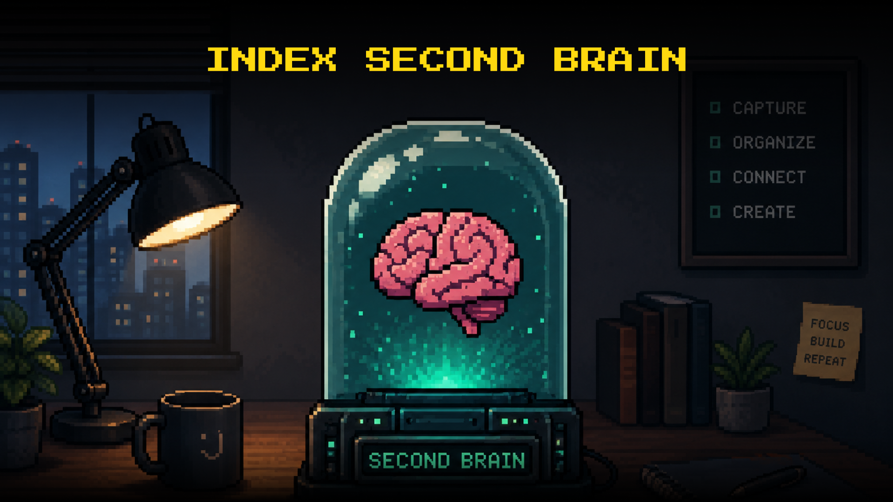

# Index Second Brain



A free, open-source company knowledge system for Claude.

Point Claude at this folder and it becomes a company brain that reads, writes, and organises your team's knowledge — decisions, projects, processes, people. No accounts. No API keys. No configuration beyond Claude Desktop.

**Free forever · MIT licensed · Made by [Index Brain](https://index.brain)**

---

## How it works

Every session, Claude reads `brain.md` and loads the context from `company.md` and `brand.md`. It knows who you are, what you're building, and how you communicate — without you explaining it again.

Drop raw thoughts into `capture/inbox.md` throughout the day. When you're ready, say **"process the inbox"** — Claude groups, cleans, and files everything into the right folder, showing you the plan before touching anything.

Decisions get their own folder. Projects live in `active/` until they're done, then move to `archive/`. The team roster lives in `team/`. Nothing gets deleted.

---

## Requirements

- **Claude Desktop** — macOS Apple Silicon or Windows
- A **paid Claude plan** — Pro, Max, Team, or Enterprise
- Nothing else

---

## Get started

**1. Download**
Click **Code → Download ZIP**, unzip it, move the folder somewhere permanent.

**2. Connect**
Open Claude Desktop → Cowork tab → point a session at this folder.

**3. Set up**
Say **"set up the brain"**. Claude asks about your company — name, team, focus, communication style — and fills in the two core files. Takes about 5 minutes. Everything is skippable.

**4. Work**
Drop notes in `capture/inbox.md`. Say "process the inbox" to file them. Ask Claude anything about your company and it answers from the files.

---

## What's inside

```
index-second-brain/
├── brain.md          instructions Claude reads every session
├── SETUP.md          the one-time company setup Claude runs for you
├── company.md        who you are — team, stage, current focus
├── brand.md          how your company sounds and writes
├── capture/
│   └── inbox.md      raw input — dump anything here, unsorted
├── active/           projects currently in progress
├── decisions/        every decision made, with reasoning, dated
├── knowledge/        things the team looks up — processes, how-tos
├── library/          reference material and links
├── team/
│   └── roster.md     who's on the team and what they own
└── archive/          finished and paused work — nothing deleted
```

---

## The capture → file loop

```
capture/inbox.md   ←  drop anything here, any time
       │
       │  "process the inbox"
       ▼
Claude groups and cleans the notes
       │
       ├──► active/        if it's a project or active task
       ├──► decisions/     if a decision was made
       ├──► knowledge/     if it's something to look up later
       └──► library/       if it's reference material
```

Claude shows the plan before filing anything. You confirm, then it moves.

---

## Decisions are first class

Most systems treat a decision like any other note. This one doesn't.

Every decision goes in `decisions/` with a dated filename — `decisions/2026-06-29-chose-stripe.md` — and includes what was decided, why, what was considered and rejected, and who was involved.

Six months later when someone asks "why did we go with Stripe?" — the answer is in the file.

---

## The two core files

| File | What it does |
|---|---|
| `company.md` | Who you are — company, team, stage, what's active right now |
| `brand.md` | How you sound — writing style, tone, words you never use |

Fill them once during setup. Update them whenever things change — just tell Claude and it edits the file directly.

---

## Team roster

`team/roster.md` tracks who's on the team and what they own. When you mention a new hire or role change, Claude updates the roster and confirms. Ask "who owns X?" and Claude checks here first.

---

## The safety rule

Claude never moves, overwrites, or deletes a file without showing you exactly what it's about to do and waiting for your confirmation.

---

## License

MIT. Use it, fork it, build on it. See `LICENSE`.

---

Made by [Index Brain](https://index.brain)
